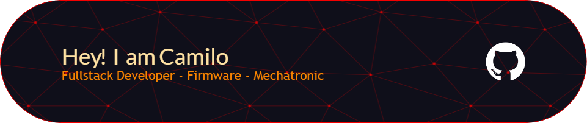

#  

### 
 ✨ Hello, welcome to my Github 🎊, I am Camilo, Mechatronic Engineer passionate about programming ⚡, so I am also a Fullsatck Developer and Firmware Engineer, I hope that my projects are to your liking and are part of your learning. 😎

### 
 
         

   
 

## Tech Stack 

    
   
  
 

     

  
  
  
  
  
  

  
  
  
  
  
 

<!--
**Hcrj99/Hcrj99** is a ✨ _special_ ✨ repository because its `README.md` (this file) appears on your GitHub profile.

Here are some ideas to get you started:

- 🔭 I’m currently working on ...
- 🌱 I’m currently learning ...
- 👯 I’m looking to collaborate on ...
- 🤔 I’m looking for help with ...
- 💬 Ask me about ...
- 📫 How to reach me: ...
- 😄 Pronouns: ...
- ⚡ Fun fact: ...
-->
